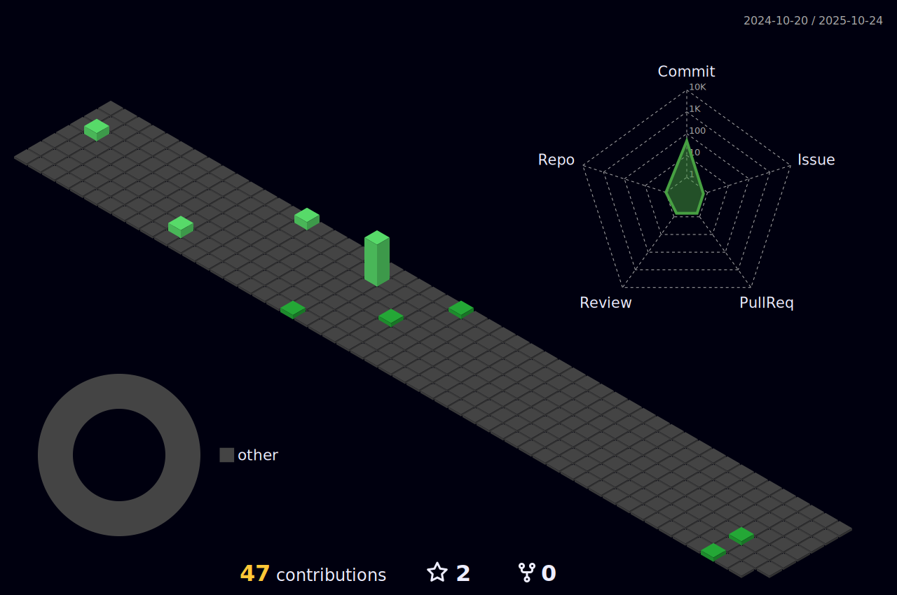

# 

                

 

 
---

### Hi there 👋, I'm @uiuiqkjn!

- 🔭 I’m currently working on **exciting Python projects** and exploring **AI/ML frameworks**.  
- 🌱 I’m currently learning **everything that sparks my curiosity**, including:  
  - Advanced Python  
  - Web development with Django/Flask  
  - Modern C++ programming  
  - Machine Learning and Data Science  
- 💬 Ask me about anything related to **Python**, **C++**, or **open-source contributions**!  
- ⚡ Fun fact: I love solving puzzles and building tools to make life easier.

---

✨ Thanks for visiting my profile! Let’s build something amazing together! 😊

<picture>
  <source media="(prefers-color-scheme: dark)" srcset="https://raw.githubusercontent.com/uiuiqkjn/uiuiqkjn/output/github-contribution-grid-snake-dark.svg">
  <source media="(prefers-color-scheme: light)" srcset="https://raw.githubusercontent.com/uiuiqkjn/uiuiqkjn/output/github-contribution-grid-snake.svg">
  
</picture>

